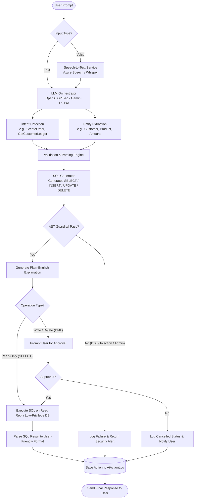

# AI Workflow & Natural Language Processing Pipeline

This document defines the end-to-end pipeline through which the system converts user natural language inputs (text or voice) into structured, secure SQL database operations.

---

## AI Pipeline Architecture (Flowchart)



---

## 1. Input Processing

### Voice Processing (Speech-to-Text)
When the user submits a voice input:
1. **Audio Recording**: The client captures audio in a compressed format (e.g., MP3 or WebM) and streams/sends it via the `POST /api/voice` endpoint.
2. **STT Processing**: The backend routes the binary stream to either **OpenAI Whisper** or **Azure Cognitive Speech Service**.
3. **Context Injection**: The resulting transcript text is combined with metadata (current timestamp, authenticated user session, role) and sent to the LLM orchestration layer.

### Text Processing
If the user types directly, the string input is passed immediately to the LLM orchestration layer with the same session context.

---

## 2. Intent Detection

The LLM is prompted to classify the user's input into a specific predefined intent. This bounds the system's capabilities and ensures it executes expected pathways.

### Predefined Intent Catalog
The system matches prompts to the following core intents:

| Category | Intent Name | Description |
| :--- | :--- | :--- |
| **Sales & Customers** | `GetCustomerLedger` | Retrieve transaction statement for a customer |
| | `AddCustomer` | Insert a new customer profile |
| | `UpdateCustomer` | Modify customer contact details |
| | `CustomerHistory` | View a history of orders/payments for a customer |
| | `TopCustomers` | Find highest purchasing customers in a timeframe |
| **Orders** | `GetPendingOrders` | List orders not yet fully shipped or completed |
| | `RecentOrders` | List most recent orders |
| | `CreateOrder` | Initialize a new order with multiple line items |
| | `UpdateOrder` | Update order status (e.g., set to Completed) |
| | `DeleteOrder` | Soft-delete an order (requires manager approval) |
| **Payments** | `GetPendingPayment` | Calculate outstanding balance for a customer |
| | `GetLastPayment` | Find details of the last payment made by a customer |
| | `RecordPayment` | Add a new receipt of payment |
| | `OutstandingCustomers`| Identify all customers with non-zero pending amounts |
| **Reporting & BI** | `SalesSummary` | Calculate overall sales totals |
| | `MonthlyReport` | Generate a monthly breakdown of sales and receipts |
| | `GSTReport` | Compute payable GST (goods and services tax) |
| | `InventorySummary` | (Future) Stock levels and replenishment alerts |
| | `ExpenseSummary` | (Future) Expense analysis |

---

## 3. Entity Extraction

The LLM extracts variables from the prompt using JSON schema structured output.

### Extracted Entities Configuration

```json
{
  "CustomerName": "Name or Code of the customer company",
  "ProductName": "Name or Code of the inventory product",
  "Quantity": "Numeric quantity of items ordered",
  "Rate": "Unit price of the product",
  "Amount": "Transaction value (payment/invoice sum)",
  "Dates": {
    "Start": "ISO 8601 Start Date",
    "End": "ISO 8601 End Date",
    "Specific": "ISO 8601 Date"
  },
  "OrderNumber": "Unique alphanumeric order identifier",
  "PaymentMethod": "Cash, Cheque, Bank Transfer, Credit Card, UPI, or Other",
  "Status": "Pending, Processing, Shipped, Completed, Cancelled",
  "Remarks": "Free-form text memo or description"
}
```

---

## 4. SQL Generation & Security Validation Rules

To prevent **SQL Injection** and **Data Loss**, the SQL generator conforms to the following strict pipeline:

### Security Rules:
1. **Low-Privilege Database Role**: The AI runs SQL queries using a database connection pool with restricted credentials. This connection has ONLY `SELECT` permission on master tables, and `SELECT, INSERT, UPDATE` on transaction tables. It has absolutely **no DDL privileges** (`DROP`, `ALTER`, `CREATE`).
2. **AST (Abstract Syntax Tree) Guardrail**:
   - Before executing any generated SQL, the backend parses the query text using an AST library (e.g., T-SQL Parser in C#).
   - It blocks any queries containing forbidden keywords: `DROP`, `TRUNCATE`, `ALTER`, `GRANT`, `REVOKE`, `SHUTDOWN`, `sys.`, `INFORMATION_SCHEMA`.
3. **Transaction Safety**: All data-modifying queries (DML) generated by the AI are wrapped in a database Transaction. If any sub-query fails, the transaction is immediately rolled back.
4. **Soft Deletes**: The generator must construct `UPDATE Table SET IsDeleted = 1` queries when a user requests a deletion. Hard deletes (`DELETE FROM Table`) are systematically intercepted and blocked.
5. **No Direct Execution**: The SQL text is returned to the API client, along with a plain-English explanation of what the query will do, prompting the user for approval.

---

## 5. Human-in-the-Loop Confirmation Workflow

To prevent destructive actions or unintended orders, the system requires confirmation based on query type:

* **SELECT Queries**: If the extracted intent is read-only (e.g., `GetPendingPayment`), the query executes immediately without prompting the user, providing a fast conversational response.
* **DML Queries (INSERT, UPDATE, DELETE)**:
  - The API responds with a structured payload containing:
    1. The generated SQL.
    2. A plain English explanation: *"This will record a payment of ₹50,000 against XYZ Traders, reducing their outstanding balance."*
    3. A unique transaction tracking token.
  - The frontend displays a confirmation dialog.
  - Only when the user clicks **Confirm**, the frontend calls `/api/approve` with the token.
  - If the user cancels, the transaction is marked as `Cancelled` in the `AiActionLog` and aborted.
