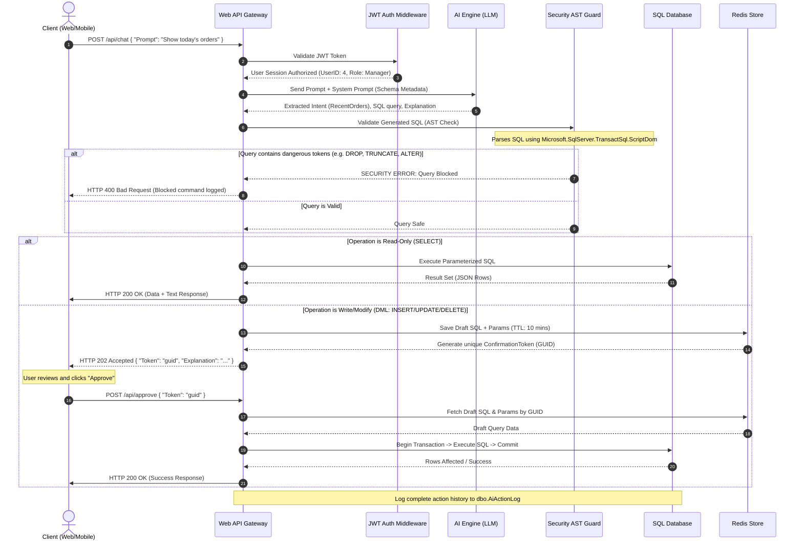

# Backend Architecture & Component Flow

This document details the backend architectural design of the AI-powered Business ERP system. The architecture is engineered around the principles of **Clean Architecture** (Onion Architecture) to ensure decoupled domains, high testability, and clear separation of concerns.

---

## Clean Architecture Layers

The ASP.NET Core Web API is divided into four distinct projects:

```
┌─────────────────────────────────────────────────────────┐
│                     Web API Layer                       │
│      Controllers, JWT Authentication, Rate Limiting      │
└───────────┬─────────────────────────────────┬───────────┘
            │                                 │
            ▼                                 ▼
┌───────────────────────┐         ┌───────────────────────┐
│   Application Layer   │         │       AI Service      │
│  MediatR CQRS, DTOs,  │         │   Intent Detection,   │
│  Validators, Use Cases│         │   Parameter Extract   │
└───────────┬───────────┘         └───────────┬───────────┘
            │                                 │
            ▼                                 ▼
┌─────────────────────────────────────────────────────────┐
│                  Infrastructure Layer                   │
│      EF Core DbContext, AST Guardrail, Redis Cache      │
└───────────┬─────────────────────────────────────────────┘
            │
            ▼
┌─────────────────────────────────────────────────────────┐
│                      Domain Layer                       │
│         Entities, Specifications, Value Objects         │
└─────────────────────────────────────────────────────────┘
```

1. **Domain Layer (Core)**: Contains enterprise business objects, database entities (e.g., `Customer`, `Order`, `Payment`), exceptions, and logic. Dependencies: None.
2. **Application Layer**: Contains business interfaces, request/response models, MediatR handlers (CQRS), FluentValidation rule sets, and the orchestrator interfaces. Dependencies: Domain.
3. **Infrastructure Layer**: Contains persistence implementations (EF Core DbContext, Repository Pattern), identity (JWT token issuance), external APIs (Azure Cognitive Speech, OpenAI integration), caching (Redis), and database verification guards. Dependencies: Application.
4. **Web API Layer (Presentation)**: Exposes HTTP REST endpoints, configures middleware (global exception handler, rate limiter, Swagger/OpenAPI, authentication registration). Dependencies: Infrastructure, Application.

---

## Complete Processing Pipeline

The execution flowchart below illustrates the path of a natural language request from the client, through authentication, AI parsing, security guardrails, validation, user confirmation, to DB transaction commit:



---

## SQL Generator & Security AST Parser

The **Validation Layer** does not execute raw strings directly. To protect the system against LLM hallucination and indirect prompt injections (where a user tricks the AI into dropping tables), the backend routes all generated SQL through an Abstract Syntax Tree (AST) checker.

### C# ScriptDom AST Guard Implementation Example

The system uses `Microsoft.SqlServer.TransactSql.ScriptDom` to parse the generated SQL. This generates a parsed syntax tree where each node represents a command type.

```csharp
using Microsoft.SqlServer.TransactSql.ScriptDom;
using System.IO;
using System.Collections.Generic;

public class SqlSafetyGuard
{
    private static readonly HashSet<string> ForbiddenStatements = new()
    {
        "DropTableStatement", "AlterTableStatement", "DropDatabaseStatement",
        "AlterDatabaseStatement", "CreateDatabaseStatement", "TruncateTableStatement",
        "GrantStatement", "RevokeStatement", "DenyStatement"
    };

    public SqlValidationResult VerifySql(string generatedSql)
    {
        var parser = new TSql160Parser(initialQuotedIdentifiers: true);
        using var reader = new StringReader(generatedSql);
        var fragment = parser.Parse(reader, out IList<ParseError> errors);

        if (errors.Count > 0)
        {
            return SqlValidationResult.Fail("SQL syntax is invalid.");
        }

        var visitor = new SQLStatementVisitor();
        fragment.Accept(visitor);

        foreach (var statement in visitor.StatementsFound)
        {
            if (ForbiddenStatements.Contains(statement))
            {
                return SqlValidationResult.Fail($"Prohibited SQL statement block detected: {statement}");
            }
        }

        return SqlValidationResult.Pass();
    }
}

// Visitor pattern to collect all statement types in the SQL block
public class SQLStatementVisitor : TSqlFragmentVisitor
{
    public List<string> StatementsFound { get; } = new();

    public override void Visit(TSqlStatement node)
    {
        StatementsFound.Add(node.GetType().Name);
        base.Visit(node);
    }
}
```

---

## Transaction & Connection Management

1. **Isolation Level**: All write operations execute under `IsolationLevel.ReadCommitted` transactions. This ensures dirty reads are prevented.
2. **Context Separation**: The Entity Framework Core database contexts use distinct Connection Pools:
   * **`AIConnection`**: Low-privilege account. Connected only for execution of NLP queries. It has Read permissions on all standard tables, and INSERT/UPDATE permission on `Payments`, `Orders`, `OrderItems`, and `Customers`. It has no DELETE or DDL access.
   * **`SystemConnection`**: Full application permissions. Used only for administrative tasks, auth checks, system logging, and execution of approved system-orchestrated queries (via the `/approve` endpoint).
3. **Execution Timeout**: AI queries are assigned a short execution timeout (`CommandTimeout = 5` seconds) to prevent infinite loops, Cartesian join locks, or denial-of-service queries.
