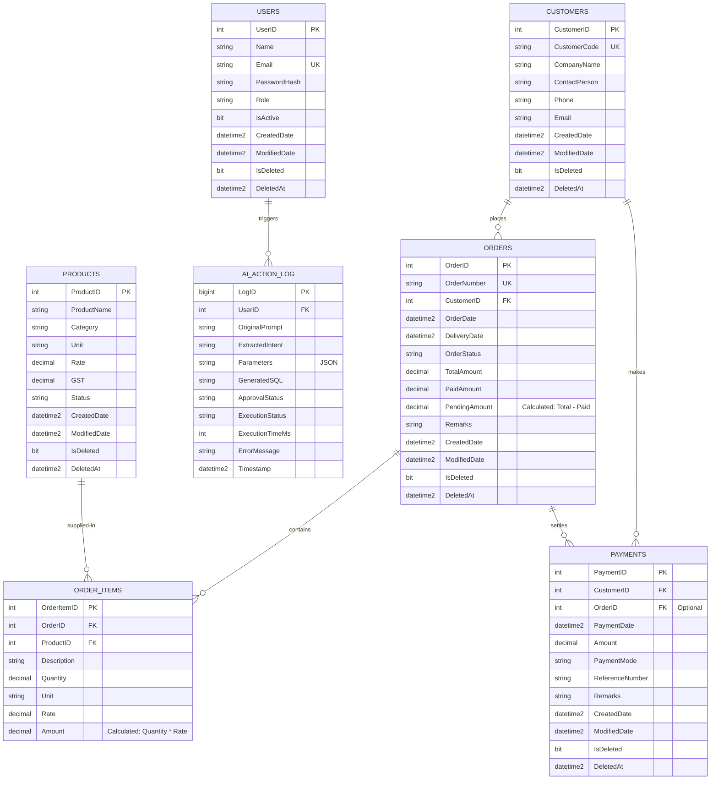

# Entity Relationship (ER) Diagram

This document details the database schema relationships, entity mappings, and cardinalities for the AI-Powered Business ERP System.

## Database ER Diagram (Mermaid)

## Detailed Relationship Catalog

### 1. Users to AI Action Log (`Users` 1 → 0..* `AiActionLog`)
* **Type**: One-to-Many
* **Primary Key**: `Users.UserID`
* **Foreign Key**: `AiActionLog.UserID`
* **Description**: Every interaction via natural language is bound to a specific authenticated user. If a user is deleted (or deactivated), their logs are retained for compliance and security audit trails.

### 2. Customers to Orders (`Customers` 1 → 0..* `Orders`)
* **Type**: One-to-Many
* **Primary Key**: `Customers.CustomerID`
* **Foreign Key**: `Orders.CustomerID`
* **Description**: A customer can place zero or more orders. An order must belong to exactly one customer.

### 3. Customers to Payments (`Customers` 1 → 0..* `Payments`)
* **Type**: One-to-Many
* **Primary Key**: `Customers.CustomerID`
* **Foreign Key**: `Payments.CustomerID`
* **Description**: A customer can make multiple payments. A payment must be mapped to a specific customer to maintain credit/debit balances in the customer ledger.

### 4. Orders to Order Items (`Orders` 1 → 1..* `OrderItems`)
* **Type**: One-to-Many (Cascade Delete)
* **Primary Key**: `Orders.OrderID`
* **Foreign Key**: `OrderItems.OrderID`
* **Description**: An order must contain at least one product line item. Deleting an order cascades and deletes its constituent line items.

### 5. Products to Order Items (`Products` 1 → 0..* `OrderItems`)
* **Type**: One-to-Many
* **Primary Key**: `Products.ProductID`
* **Foreign Key**: `OrderItems.ProductID`
* **Description**: A product can be ordered in multiple items across different orders. Restricting hard deletes on products ensures historical order items remain valid. Soft-delete is implemented using `IsDeleted = 1`.

### 6. Orders to Payments (`Orders` 0..1 → 0..* `Payments`)
* **Type**: Optional One-to-Many
* **Primary Key**: `Orders.OrderID`
* **Foreign Key**: `Payments.OrderID`
* **Description**: A payment can optionally be applied to a specific invoice/order. Alternatively, payments can be made "on account" (unapplied to any specific order), which maps to the Customer's overall outstanding balance.

---

## Indexing & Archiving Strategy

To support high-speed querying from the AI Engine, index files are configured for the following critical foreign keys:
1. **`IX_Orders_CustomerID`**: Speeds up queries searching for "orders placed by customer X".
2. **`IX_OrderItems_OrderID`**: Accelerates line-item rendering for orders.
3. **`IX_Payments_CustomerID`**: Essential for generating customer ledgers and calculating outstanding balances.
4. **`IX_Payments_OrderID`**: Speeds up checking payment history for a specific order.
5. **`IX_AiActionLog_UserID`**: Critical for filtering user-specific actions and audit dashboards.
6. **`IX_Users_IsDeleted`**: Enhances queries checking for active users.
