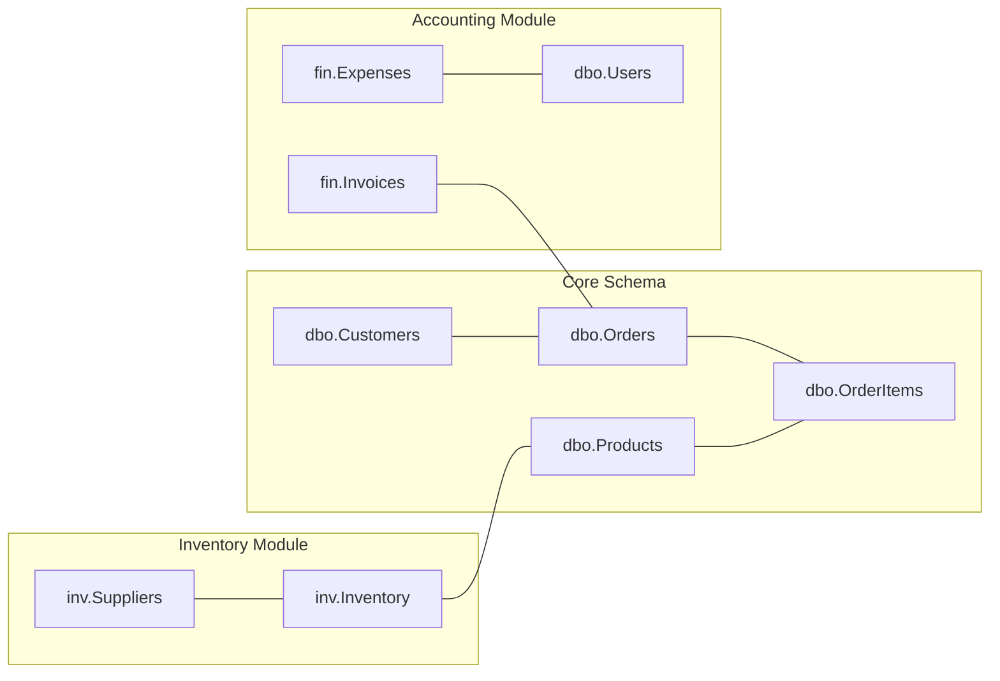

# Security & Scalability Blueprint

This document details the security safeguards and modular scaling strategy for the enterprise AI-powered Business ERP system.

---

## Part 1: Security Architecture

To protect core financial and customer records from unauthorized natural language instructions, we enforce a multi-layered security system.

### 1. Role-Based Access Control (RBAC)
User session roles (`Admin`, `Manager`, `Accounts`, `Sales`) map strictly to allowed database operations and NLP intents. The AI engine validates the user's role before generating queries.

| Intent Category / Name | Admin | Manager | Accounts | Sales | Action Required |
| :--- | :---: | :---: | :---: | :---: | :--- |
| `GetPendingPayment` / `GetCustomerLedger` | Yes | Yes | Yes | Yes | Auto-Execute (Read-Only) |
| `SalesSummary` / `MonthlyReport` | Yes | Yes | Yes | No | Auto-Execute (Read-Only) |
| `AddCustomer` / `UpdateCustomer` | Yes | Yes | Yes | Yes | Requires Approval (DML) |
| `CreateOrder` / `UpdateOrder` | Yes | Yes | No | Yes | Requires Approval (DML) |
| `RecordPayment` | Yes | Yes | Yes | No | Requires Approval (DML) |
| `DeleteOrder` | Yes | Yes | No | No | Requires Manager Approval (Soft Delete) |
| `GSTReport` | Yes | Yes | Yes | No | Auto-Execute (Read-Only) |

*If a Sales representative says: "Delete order 1025", the AI pipeline will intercept the request at the authorization boundary and return:* `"Access Denied: The 'Sales' role does not have permission to delete orders. Please contact a Manager or Admin."`

---

### 2. SQL Injection Prevention & Parameterization
The AI engine does not construct raw strings (e.g., `WHERE Name = 'XYZ'`). It generates metadata mappings containing **Query Templates** and **Param-Value Dictionaries**.
The execution engine maps these to standard parameterized commands (`SqlCommand.Parameters.AddWithValue`). This protects the system against:
* Direct user injection (e.g., `"Delete order 1025; DROP TABLE Orders;"`).
* Indirect prompt injection (where a customer name in the database contains instructions that trick the LLM).

---

### 3. Audit Logs & AI Action Logs
Every query request executes an audit trigger saving logs to the `AiActionLog` table:
* **`UserID`**: Tracks who initiated the request.
* **`OriginalPrompt`**: The raw text/voice transcript.
* **`GeneratedSQL`**: The exact statement sent to the database.
* **`ApprovalStatus`**: Records if the action was approved, rejected, or auto-run.
* **`ExecutionStatus`**: Captures if the DB executed successfully or threw an exception.
This audit trail is write-only for standard app roles. It can never be updated or deleted except by a Database Administrator.

---

### 4. Soft Deletes
Physical deletion (`DELETE FROM Table`) is disabled on transaction-carrying tables: `Customers`, `Products`, `Orders`, and `Payments`.
* **Mechanism**: An `IsDeleted` BIT column is set to `1` when a deletion intent is approved.
* **Query Safety**: All generated query templates append `WHERE IsDeleted = 0`.
* **Database Constraints**: Foreign keys on transaction tables are set to restrict delete. If an attempt is made to delete a product that has historical orders, the database engine enforces data integrity.

---

### 5. Data Encryption & Key Management
1. **Passwords**: Hashed using **PBKDF2 with SHA-256** (with salt) or BCrypt. Passwords are never stored in plain text.
2. **In-Transit**: Standard HTTPS with TLS 1.3 enforced for all API routes. SQL Server connections use force encryption (`Encrypt=True;TrustServerCertificate=False`).
3. **At-Rest**: Azure SQL Database enforces **Transparent Data Encryption (TDE)** automatically to protect backups and data files on disk.
4. **Secret Storage**: Database connection strings, OpenAI keys, and JWT signing keys are stored in **Azure Key Vault** and injected into app configuration at runtime.

---

### 6. Rate Limiting & Auth Middleware
* **JWT Bearer Token**: Every API call includes a JWT in the `Authorization` header containing the user's ID, Email, and Role.
* **Rate Limiting**: Configured in ASP.NET Core using **Redis Token Bucket Rate Limiting**:
  * `/api/chat` and `/api/voice` are restricted to **20 requests per minute** per user token. This limits API token costs and protects against Denial-of-Service (DoS) loop attacks.

---

## Part 2: Scalability & Future Roadmap

The ERP system is designed to grow without rewriting core engines. By adopting a **modular monolith** structure transitioning to microservices, new domains plug directly into existing interfaces.

### 1. Database Schema Extension Strategy
To add modules like Inventory, Suppliers, and Invoices:
* **Separate Schema Prefixes**: Group new tables by schema prefix (e.g., `inv.Inventory`, `pur.Suppliers`, `fin.Invoices`).
* **Foreign Key References**: Link `inv.Inventory` to `dbo.Products` and `fin.Invoices` to `dbo.Orders` to ensure strict database integrity.
* **Migrations**: Use Entity Framework Core migrations to roll out new tables incrementally without stopping the service.



---

### 2. AI Engine Extension Roadmap
To teach the AI new modules, developers update:
1. **System Prompt Meta-Descriptions**: Feed the LLM the new SQL schema catalogs (e.g., describing tables for `Inventory` or `Suppliers`).
2. **Intent Catalog**: Register new intents (e.g., `GetStockLevel`, `ReorderProduct`, `LogExpense`).
3. **Entity Extraction Schema**: Expand the extraction model to capture entities like `SupplierName`, `InvoiceNumber`, `ExpenseCategory`.

---

### 3. Azure Cloud Deployment Architecture

The production environment maps to the following Azure components:

```
                            [ User Request ]
                                   │
                                   ▼
                     ┌───────────────────────────┐
                     │    Azure Front Door /     │
                     │  Web Application Firewall │
                     └─────────────┬─────────────┘
                                   │
                                   ▼
                     ┌───────────────────────────┐
                     │    Azure App Services     │
                     │  (ASP.NET Core Web API)   │
                     └─────────────┬─────────────┘
                ┌──────────────────┼──────────────────┐
                ▼                  ▼                  ▼
      ┌──────────────────┐ ┌──────────────┐ ┌──────────────────┐
      │  Azure Key Vault │ │ Azure Cache  │ │ Azure Cognitive  │
      │ (Secrets & Keys) │ │ for Redis    │ │ Services (STT)   │
      └──────────────────┘ └──────────────┘ └──────────────────┘
                │                  │
                ▼                  ▼
      ┌──────────────────┐ ┌──────────────┐
      │ Azure SQL (Read) │ │ Azure SQL    │
      │ Replica / Reports│ │ (Write DB)   │
      └──────────────────┘ └──────────────┘
```

1. **Azure Front Door (WAF)**: Handles global load balancing, SSL termination, and filters malicious traffic.
2. **Azure App Services**: Hosts the Dockerized ASP.NET Core API. Configured with horizontal auto-scaling based on CPU/Memory load.
3. **Azure Cache for Redis**: Caches user session metadata, API rate-limiting buckets, and the dynamic SQL approval tokens.
4. **Azure SQL Database (Hyperscale)**: Run with an Active Geo-Replication setup. The AI execution service routes all `SELECT` operations to the Read-Only replica, protecting the transactional database from performance hits.
5. **Azure Cognitive Services**: Handles Speech-to-Text translation for conversational inputs.
6. **Azure Application Insights**: Monitors API response times, traces errors, and tracks performance metrics of LLM calls.
